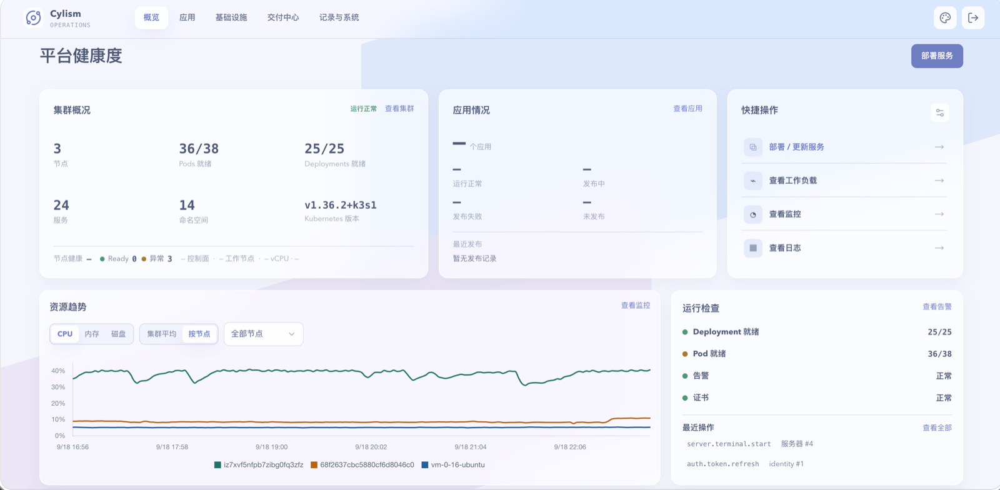

<div align="center">

# Cylism Manager

**A management dashboard for personal servers, Kubernetes clusters, and self-hosted services.**

[](https://github.com/SurryChen/cylism-manager/actions/workflows/docker-image.yml)
[](https://surrychen.github.io/cylism-manager/)
[](LICENSE)

[简体中文](README.md) · [Documentation](https://surrychen.github.io/cylism-manager/) · [Get started](docs/getting-started.md) · [Contributing](CONTRIBUTING.md) · [Security](SECURITY.md)

</div>

I run a few Linux servers, a K3s cluster, and some services on it. None of this is especially large, but looking after it still means SSH for machines, `kubectl` for resources, then separate places for releases, domains, certificates, and logs.

I built Cylism Manager as a self-hosted dashboard for that routine work. It is not meant to hide the command line; it is meant to make the things I check and do most often easier to find.

<p align="center">
  <a href="docs/assets/screenshots/platform-overview.png">
    
  </a>
</p>

## What it does today

- Shows the state of managed hosts, nodes, services, and recent operations
- Runs host preflight checks and basic maintenance through SSH
- Lets you inspect and manage common Kubernetes resources
- Tracks images, deployments, and application releases
- Configures service domains and certificates

It is aimed at a few servers and a small cluster. For complex debugging, fleet operations, or low-level cluster configuration, SSH, `kubectl`, and the usual tools are still the better place to work.

Kubernetes is the baseline. K3s gets extra support for node joining and `vpn-auth` diagnostics. Tailscale and other VPNs stay managed outside Manager; it does not install, register, or upgrade them.

> [!WARNING]
> Manager is not a read-only dashboard. It needs Kubernetes management permissions and holds protected SSH credentials. Deploy it only in a cluster you trust, and read the [security policy](SECURITY.md).

## Install

Read the [installation prerequisites](docs/installation/prerequisites.md) first. The cluster needs PVC storage, and you need an SSH private key for the servers you intend to manage.

- [Deployment script](docs/installation/install-script.md): interactive initial setup.
- [Helm Chart](docs/installation/install-helm.md): environments already managed with Helm values.
- [Getting started guide](docs/getting-started.md): first login and server onboarding.
- [Documentation site](https://surrychen.github.io/cylism-manager/): complete reference.

### Deployment script

For a single-node control plane or an interactive initial setup:

```bash
git clone https://github.com/SurryChen/cylism-manager.git
cd cylism-manager

bash scripts/deploy-platform.sh \
  --image ghcr.io/surrychen/cylism-manager:latest \
  --namespace cylism-system \
  --ssh-key ~/.ssh/id_ed25519 \
  --verify-image-pull
```

### Helm Chart

Create the required Secrets first as described in the [Helm installation guide](docs/installation/install-helm.md):

```bash
helm upgrade --install cylism-manager charts/cylism-manager \
  --namespace cylism-system \
  --create-namespace \
  --set image.repository=ghcr.io/surrychen/cylism-manager \
  --set image.tag=latest \
  --set secrets.existingSecret=cylism-secret \
  --set ssh.existingSecret=cylism-ssh-key
```

## Operating notes

- Manager stores its SQLite state in a PVC. Back up the PVC before upgrades, and do not delete it during a normal upgrade.
- SQLite has a single writer. The Deployment uses `Recreate`, so upgrades have a short period of unavailability.
- Manager needs broad Kubernetes permissions and is not intended for shared clusters that only allow namespace-scoped read access.
- K3s node joining and `vpn-auth` diagnostics appear only when K3s is detected; standard Kubernetes environments can still use the common features.

## Development

You need Go 1.25+, Node.js 24+, and npm. Docker, Helm, Python 3.10+, and a Kubernetes test cluster are optional depending on the change.

```bash
go test ./...
go run ./cmd/platform

npm --prefix web ci
npm --prefix web run dev
```

See [CONTRIBUTING.md](CONTRIBUTING.md) for the full verification commands and OpenSpec change process.

## License

Cylism Manager is licensed under the [Apache License 2.0](LICENSE).
