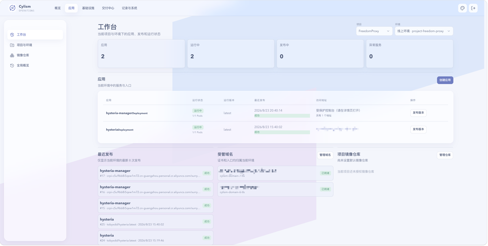

# 应用工作台

## 用途与边界

应用工作台面向一个项目和环境，集中查看应用运行状态、最近发布、受管域名和已授权镜像仓库。它是应用视图，不是 Kubernetes 全量资源浏览器。

## 进入位置

进入“应用”，选择“工作台”，在顶部切换项目和环境。

## 准备条件

项目中至少应有一个可用环境；创建应用前需准备可用的上线模板和镜像来源。

## 核心操作

1. 选择项目与环境，查看运行中、发布中和需要关注的应用。
2. 新建应用后进入详情页，设置工作负载类型、上线模板和运行依赖。
3. 从列表发起发布，或通过应用详情检查域名、模板和历史记录。
4. 用全局概览查看跨项目的失败发布和证书异常。

<figure class="documentation-screenshot">
  
  <figcaption>应用工作台：应用运行状态、最近发布与受管域名。</figcaption>
</figure>

## 状态与风险

“运行中”由工作负载与 Pod 就绪情况得出；“发布成功”不等同于外部域名已经可访问。模板依赖缺失或证书未就绪时，应先处理详情页提示再继续发布。

## 关联页面

[项目与环境](projects-and-environments.md)决定应用落点；[域名与应用访问](domains-and-access.md)处理对外入口。
