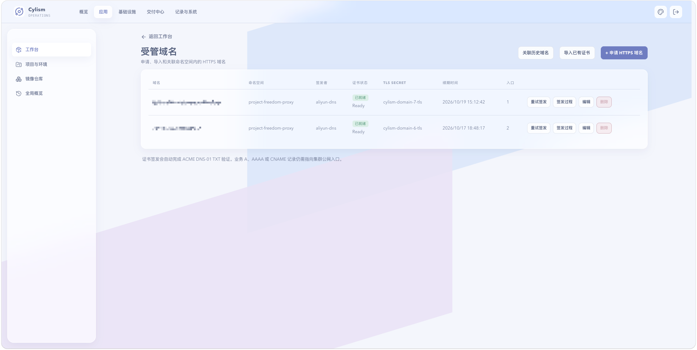

# 域名与应用访问

## 用途与边界

此处管理环境内应用的对外域名、HTTP Ingress 与证书关联；没有绑定域名的应用仍可仅在集群内访问。非 HTTP 协议的地址可以保存为访问标识，但不会生成 Ingress。

## 进入位置

从应用详情的“对外域名”进入，或在应用工作台打开“管理域名”。

## 准备条件

确认 DNS 已按组织的入口方案配置，目标应用已具备可用 Service。启用 TLS 前准备证书签发所需的域名验证条件。

## 核心操作

1. 为应用绑定域名，选择是否启用 HTTP Ingress。
2. 查看域名、证书 Secret 和签发状态；异常时先确认 DNS 与证书原因。
3. 变更域名配置后，确认实际启用的 Ingress 已同步。
4. 对无归属的历史域名，先补齐环境归属，再用于发布。

<figure class="documentation-screenshot">
  
  <figcaption>域名与应用访问：受管域名、证书状态和入口。</figcaption>
</figure>

## 状态与风险

证书“已就绪”表示 Secret 可用，不保证外部网络、DNS 传播或后端服务一定正常。删除或改绑域名会中断现有访问；生产变更应在低峰期执行并保留回退记录。

## 关联页面

[网络与证书](../platform/network-and-certificates.md)说明平台侧资源；[发布与版本记录](releases.md)说明应用版本变更。
