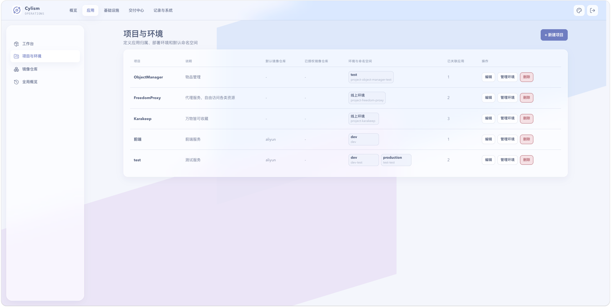

# 项目与环境

## 用途与边界

项目用于归集应用和镜像仓库授权；环境定义部署目标和默认 Kubernetes 命名空间。它们不替代集群的 RBAC，也不创建跨集群的发布流程。

## 进入位置

进入“应用”后选择“项目与环境”，再打开目标项目查看或管理环境。

## 准备条件

先确定项目名称、环境名称及目标命名空间。创建命名空间需要当前集群连接正常；绑定已有命名空间前，应确认其中资源的归属。

## 核心操作

1. 新建项目，填写名称和说明；需要时指定已授权的默认镜像仓库。
2. 在项目中新增环境，选择创建命名空间或绑定已有命名空间。
3. 命名空间未就绪时使用“同步命名空间”，确认状态后再创建应用。
4. 环境已有应用时，先迁移或删除应用，再调整部署目标。

<figure class="documentation-screenshot">
  
  <figcaption>项目与环境：项目列表、环境命名空间与管理入口。</figcaption>
</figure>

## 状态与风险

环境状态反映命名空间是否可用，不代表其中所有工作负载健康。删除项目或环境不可恢复；环境已有应用时不要直接变更命名空间，以免发布记录和资源归属不一致。

## 关联页面

[应用工作台](application-workspace.md)管理环境内的应用；[发布与版本记录](releases.md)说明镜像和版本如何进入该环境。
