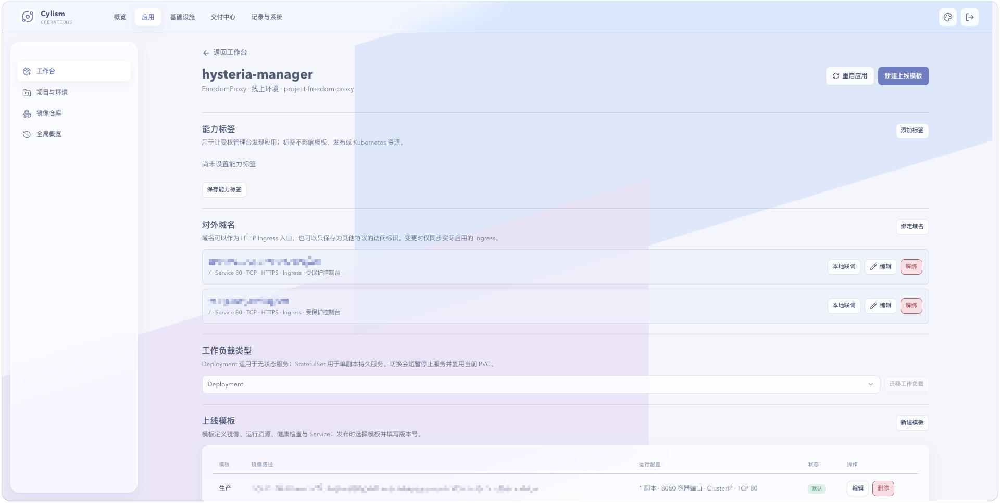

# 发布与版本记录

## 用途与边界

发布将应用的上线模板与版本号组合为镜像，并保存一次独立快照。后续修改模板、域名或依赖不会改写既有记录。

## 进入位置

从应用工作台点击“发布版本”，或在应用详情的发布记录中打开某次发布。

## 准备条件

应用需要至少一个已启用的上线模板。模板中的镜像路径、资源配置、健康检查、Service 和文件依赖应已校验；项目须已授权对应镜像仓库。

## 核心操作

1. 在应用详情创建或编辑上线模板，并设定默认模板。
2. 选择模板，填写符合规则的版本号，提交发布。
3. 在发布详情查看镜像、模板快照、执行状态与关联资源。
4. 发布失败时根据状态和事件修正配置后重新发起，不要将同一次失败记录视为可编辑任务。

<figure class="documentation-screenshot">
  
  <figcaption>应用详情：域名、工作负载类型和上线模板。正式的发布记录页面截图待后续补充。</figcaption>
</figure>

## 状态与风险

发布可能处于进行中、成功或失败。更换工作负载类型会短暂停止服务；镜像标签若被覆盖，历史版本名称仍在但实际镜像内容可能已改变，应使用不可变标签。

## 关联页面

[自托管制品库](../supply-chain/managed-registry.md)和 [Registry Proxy](../supply-chain/registry-proxy.md)说明镜像来源；[应用工作台](application-workspace.md)显示最近发布。
