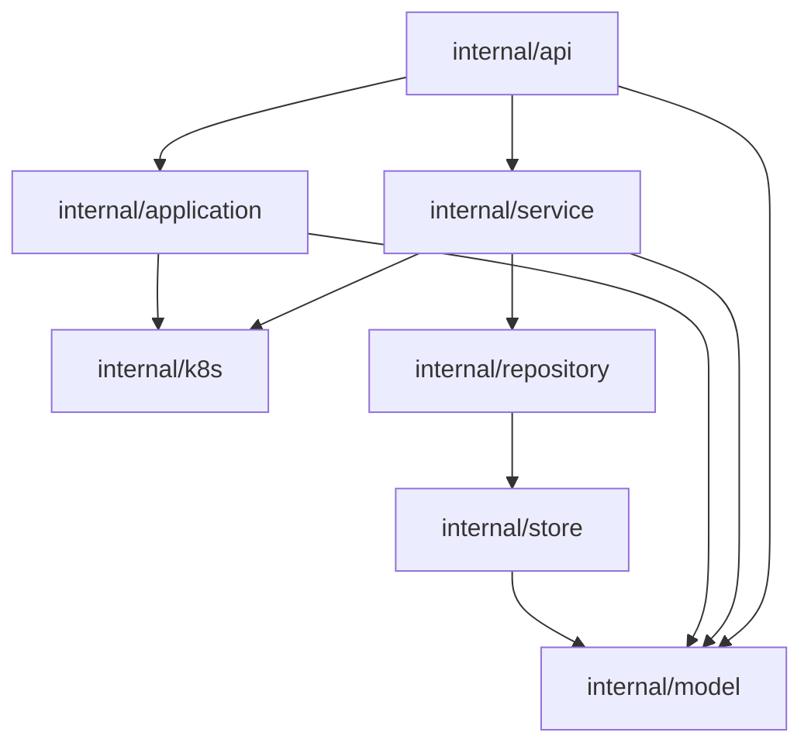

# Cylism Manager Internal Architecture Optimization Plan

状态：阶段 0～6 已完成（2026-09-02）

本文档针对 `internal/` 目录的可维护性和复用能力进行优化规划。目标是逐步收窄模块职责、减少隐式依赖和重复逻辑，同时保持现有 REST API、数据库结构、Kubernetes 资源行为和前端工作流不变。

## 1. 现状基线

当前 `internal/` 已经具备 API、Service、K8s Adapter、Store 和 Domain Model 的基本分层，API 领域 Handler 已按功能物理归组：

| 位置 | 生产代码规模 | 主要问题 |
|---|---:|---|
| `internal/api` 根包 | 仅保留路由/组装与特殊适配 | 业务 Handler 已迁入领域子目录 |
| `internal/api/application_handler.go` | 2073 行 | 同时处理项目、环境、应用、发布、模板和 Endpoint |
| `internal/api/router.go` | 527 行 | 路由注册和依赖组装耦合在一个函数 |
| `internal/api/infrastructure/k8s_handler.go` | 1103 行 | Namespace、Workload、Service、ConfigMap、Secret、Ingress 混在一个 Handler |
| `internal/store/store.go` | 1923 行 | 约 190 个跨领域持久化方法集中在一个 Store |
| `internal/k8s` | 约 7300 行 | 每个文件虽按功能拆分，但 Adapter、Reconcile、状态查询仍经常混合 |
| `internal/application/spec_*.go` | 已按职责拆分 | 发布 Spec、校验、归一化、渲染和安全清理分别归位 |
| `internal/api/system/alerting_handler.go` | 约 978 行 | HTTP、Alertmanager、SMTP 和自动化职责混合 |

已经完成的领域迁移包：

```text
internal/api/agent/
internal/api/auth/
internal/api/application/
internal/api/runtime/
internal/api/delivery/
internal/api/infrastructure/
internal/api/system/
```

这些包作为后续拆分的参考边界，不再回退到 API 根包。

## 2. 优化目标

1. 一个 Handler 只负责一个业务聚合或一个基础设施资源族。
2. Handler 只做请求绑定、鉴权上下文提取、Service 调用和响应映射。
3. 业务规则进入 `internal/service` 或 `internal/application`，持久化进入 Repository/Store Adapter，Kubernetes 操作进入 `internal/k8s` Adapter/Reconciler。
4. 消除跨领域包复用内部辅助函数的情况，API 通用能力进入 `internal/api/shared`，与 API 无关的安全能力进入 `internal/security`。
5. 将根包 `internal/api` 收敛为路由注册和少量特殊适配入口；应用依赖组装逐步迁入 `internal/bootstrap`。
6. 每次迁移都可以独立验证、独立提交和回滚。

## 3. 目标结构

```text
internal/
  bootstrap/
    container.go
    kubernetes.go
    repositories.go
    services.go
    handlers.go
  api/
    auth/
    application/
      project_handler.go
      environment_handler.go
      application_handler.go
      release_handler.go
      template_handler.go
      endpoint_handler.go
      runtime_view.go
    agent/
    delivery/
    infrastructure/
    system/
    shared/
      http.go
      identity.go
    (root: router.go, routes_*.go, websocket.go, cluster_adapter.go)
  security/
    sanitize.go
  application/
    spec_types.go
    spec_validation.go
    spec_normalization.go
    spec_rendering.go
    spec_security.go
    service.go
    release_workflow.go
    kubernetes.go
  service/
    application/
    observability/
    cluster/
    network/
    platform/
    registry/
    storage/
  repository/
    runtime_repository.go
    application_repository.go
    release_repository.go
    infrastructure_repository.go
    observability_repository.go
  k8s/
    workload.go
    namespace.go
    config.go
    ingress.go
    system_components.go
    reconciler_*.go
  runtime/
    adapter.go
    image.go
    kubernetes.go
    chat/
      client.go
      sse.go
      types.go
    identity/
      identity.go
    artifact/
      artifact.go
    cli/
      client.go
  store/
    db.go
    migrations.go
    repositories.go
  model/
    application.go
    application_capabilities.go
    application_managed_file.go
    auth.go
    errors.go
    response.go
    runtime.go
    infrastructure.go
    registry.go
    observability.go
    platform.go
```

这里的文件拆分优先于 Go package 拆分。同一领域内部先保持 package 不变，只有出现清晰的依赖边界和独立测试价值时才新建 package，避免为了目录数量增加而增加适配代码。

## 4. 分阶段实施

### 阶段 0：基线和低风险清理（已完成）

目标：建立可比较的基线，先处理不涉及结构变化的明确问题。

任务：

- 修正 `internal/api/system/dependencies.go` 中错误的 `k8sClient 集群未连接` 文案。
- 新增 `internal/api/shared`，统一 `getUserID`、`k8sUnavailable` 和 ID 解析的实现归属；所有调用点已直接使用 shared 函数，原有兼容 helper 已删除。
- 核对现有领域 API 测试和 Router 路由清单，后续按领域迁移继续补充成功、鉴权失败、Kubernetes 不可用和 Store 错误的路由级回归测试。
- 记录 `internal/api` 复杂度、路由分组和调用点清单。
- 记录 `go test ./...`、`go build ./...` 和前端构建结果，详见 `docs/archive/architecture/internal-architecture-stage0-baseline.md`。

验收：无 API 行为变化，完整测试和构建通过。

### 阶段 1：Application API 拆分（已完成）

目标：处理当前最大的 `ApplicationHandler`，这是降低复杂度和提高复用率的最高优先级。

拆分范围：

- 项目和环境：`project_handler.go`、`environment_handler.go`
- 应用生命周期：`application_handler.go`
- 发布、重启、重试和回滚：`release_handler.go`
- Deployment Template：`template_handler.go`
- Application Endpoint：`endpoint_handler.go`
- 工作台和运行状态查询：`runtime_view.go`

实施结果：

- `ApplicationHandler` 依赖结构、构造函数和应用生命周期入口保留在 `application_handler.go`。
- 项目、环境、运行态、发布、模板和 Endpoint 实现已分别迁入 `internal/api/application`，运行时与聊天入口迁入 `internal/api/runtime`，认证入口迁入 `internal/api/auth`；路由路径和公开构造函数行为保持不变。
- 发布路径继续调用 `application.ReleaseWorkflow`，模板加密/脱敏和 Endpoint 同步逻辑未复制状态机。
- 工作台、发现和集成读取路径通过 `internal/service/application.QueryService` 复用项目、环境、应用和发布查询；环境归属解析和 Kubernetes 运行态 DTO 组装也已迁入该只读 Service。
- 路由级回归测试已按项目、环境、应用、运行态、发布、模板、Endpoint 和集成入口物理拆分到对应 `*_handler_test.go`，共享 router fixture 保留在 `application_handler_test.go`。

阶段一验收记录见 `docs/archive/architecture/internal-architecture-stage1-baseline.md`。

要求：

- 保持现有 `NewApplicationHandler` 的外部行为，先使用同一个内部依赖结构。
- 将重复的应用查询、环境解析和运行状态组装提取为小型只读 Service。
- 发布流程继续复用 `application.ReleaseWorkflow`，不在新 Handler 中复制状态机。
- 每个拆分文件的测试与源文件同目录，先移动测试再调整实现。

验收指标：

- 单个 Application HTTP Handler 文件原则上不超过 800 行。
- 发布和 Endpoint 逻辑不再直接复制项目/环境查询代码。
- 现有应用创建、发布、重启、回滚、模板和 Endpoint 页面回归通过。

### 阶段 2：Store 和 Repository 分域（已完成）

目标：消除 `Store` 作为全系统万能依赖的情况。

顺序：

1. 先为 Runtime、Application、Release、Infrastructure、Observability 定义最小 Repository 接口。
2. 用现有 `Store` 实现这些接口，保持数据库实现不变。
3. 逐个 Service 和 Handler 改用接口，使用 `rg` 检查旧 Store 调用点。
4. 将查询和事务实现物理移动到 Repository 文件。
5. 最后把 `store.go` 收敛为数据库初始化、迁移和兼容入口。

不做的事情：

- 不一次性重写所有 Store 方法。
- 不在 Repository 中放业务规则或 Kubernetes 调用。
- 不为每个简单字段访问创建没有复用价值的抽象。

当前进度：

- 已完成 2.1：新增 `internal/repository/application_repository.go`，定义 `ApplicationQueryRepository`、`ReleaseRepository` 和 `ReleaseWorkflowRepository` 三个按消费者能力收敛的接口；现有 `*store.Store` 通过编译期断言继续作为过渡实现。
- `internal/service/application.QueryService`、`internal/application.Service` 和 `internal/application.ReleaseWorkflow` 已依赖 Repository 接口，不再在生产代码中导入或持有 `*store.Store`。
- 新增发布 Service 的 Repository Stub 单测；SQLite Store 测试继续保留，分别覆盖可替换性和真实持久化行为。
- Release、受管文件和应用能力元数据的 GORM 实现已物理迁入 `internal/store/application_release_repository.go`。
- 项目、环境、Application 查询、Deployment Template 和 Endpoint 的 GORM 查询与事务已物理迁入 `internal/store/application_repository.go`。环境命名空间唯一性校验、模板 Revision 乐观锁、默认模板与 Endpoint 路由冲突事务保持不变。
- `ApplicationHandler` 新增 `ApplicationManagementRepository` 依赖。项目、环境、应用元数据、模板和 Endpoint Handler 的查询/写入均通过该接口；受管域名、镜像仓库、Kubernetes 操作及发布工作流仍经由各自的明确依赖处理。
- 资源引用检索及集成 Session 等跨 Application/Infrastructure 边界能力暂留 Store；`GetEnvironmentByID` 已在 PVC、域名和证书消费者明确后迁入 Infrastructure Repository。
- 已完成 Runtime 与 Agent 持久化：新增 `RuntimeRepository`、`AgentCapabilityRepository`、`AgentOperationRepository` 以及两个面向 Agent API 的组合接口；Runtime Handler、聊天路径和 Agent API 不再依赖具体 `*store.Store`。Runtime、授权和操作的 GORM 实现已迁入 `internal/store/runtime_repository.go`。
- 已完成 Infrastructure 持久化的首批边界：`ServerRepository`、`NetworkRepository`、`CertificateRepository`、`StorageRepository`、`PVCRepository` 和 `NodeJoinRepository` 已按消费者定义。Cluster Service、Network Service、Storage Service、域名、证书、PVC、服务器诊断、终端和节点加入 Handler 使用这些接口；服务器、环境只读、域名、DNS 凭据和 PVC 任务实现已迁入 `internal/store/infrastructure_repository.go`。
- 已完成 Observability 持久化：告警自动化、审计和系统组件配置的 Handler/中间件使用 `AlertRepository`、`AuditRepository`、`SystemComponentRepository` 或最小组合接口；其 GORM 实现已迁入 `internal/store/observability_repository.go`。
- `service/cluster`、`service/platform`、`service/network`、`service/storage` 均已消除对具体 `*store.Store` 的依赖。Network/Storage 的凭据与任务记录通过明确的可选 Repository 注入；不再使用 Store 类型断言作为回退。
- Registry 持久化已完整迁入 `internal/store/registry_repository.go`：镜像仓库、节点镜像源、Registry Proxy、受管 OCI 制品库和 Chart Repository 分别由 `ImageRegistryRepository`、`NodeRegistryMirrorRepository`、`RegistryProxyRepository`、`ManagedRegistryRepository`、`ChartRepositoryStore` 提供给 Registry Service 和交付中心 Handler。
- `K8sHandler` 已改为注入 `ResourceReferenceRepository`、预组装的 Storage Service 与 `AuditRepository`；原有 Store 可变参数构造路径已删除。Logging 使用 `LoggingScopeRepository`，Tailscale 使用 `SystemConfigRepository`，两者均不再持有具体 Store。
- 集群 DNS、站点/证书、用户、操作日志、集成 Session、资源引用和仪表盘统计已分别迁入 `cluster_repository.go`、`site_repository.go`、`auth_repository.go`、`operation_repository.go`、`integration_repository.go`、`resource_reference_repository.go`、`observability_repository.go`。这些接口均有明确消费者，未为无调用方的记录额外创建泛化抽象。
- `ApplicationHandler` 已改为依赖其私有的 `ApplicationHandlerRepository` 组合能力；应用、发布、受管文件、集成会话和工作台域名读取不再持有具体 Store。域名信息组装提取为 `ManagedDomainInfoFor`，只依赖端点引用计数和可选的证书查询，避免反向创建完整域名生命周期 Service。
- `store.go` 已收敛至约 266 行，只保留 SQLite 初始化、迁移、数据回填和 `DB()`。生产代码中对 `*store.Store` 的直接持有仅剩 Router 依赖组装根，以及必须执行通用 GORM 表管理的 `DBAdminHandler`；后者是明确的受限管理例外，不作为业务 Repository 的替代入口。
- 命名空间冲突及模板 Revision 冲突的领域 DTO/Error 已迁入 `model`；Repository 接口和 Application Handler 不再反向导入 `internal/store` 取得错误类型。
- 已补充独立 Fake/Stubs：Registry Proxy、受管 OCI 制品库、节点镜像源、外部镜像仓库和 Chart Repository 持久化契约，以及 K8s 资源引用保护、Tailscale 系统配置读取和域名只读信息组装；SQLite Store 测试继续覆盖真实事务、唯一性和状态更新。

验收（2026-08-31）：`go test ./...`、`go build ./...`、`nvm use 24 && npm --prefix web run build`、`git diff --check` 均通过。前端构建保留既有主 JS chunk 超过 500 kB 的 Vite 警告，未阻塞构建。

### 阶段 3：Kubernetes Adapter 和 Reconciler 整理

当前进度（2026-09-01）：

- 已完成第一批只读 Adapter：新增 `internal/service/application.RuntimeReader`，运行态查询不再直接依赖完整 `*k8s.Client`；`internal/k8s/runtime_reader.go` 提供 Service、Deployment、StatefulSet 和 Pod 的按命名空间读取实现。
- 已为运行态 Reader 增加 Fake/Clientset 回归测试，并为平台发布 Service 定义最小 `PlatformAdapter`，移除了 Service 对完整 K8s Client 的业务依赖。
- 已完成第二批 Reconciler 边界：受管 OCI 制品库和 Registry Proxy Handler 改为依赖最小 Reconciler 接口，不再把具体 Reconciler 类型作为 HTTP Handler 的持有类型。
- 已完成应用发布资源 Apply 接口化：`KubernetesApplier` 通过 `ApplicationResourceApplier` 编排 ConfigMap、Secret、Deployment、StatefulSet、Service、Ingress 和 Certificate，真实实现集中在 `internal/k8s/application_resources.go`，可由 Fake 替换。预检、工作负载控制、Endpoint 读取和发布诊断分别由最小 Adapter 接口承载，CRD、Ingress Controller 和 PVC 预检均透传调用方 context。
- 已完成 PVC Adapter 物理职责拆分：基础设施 Storage Handler 分别注入 `PVCRepositoryAdapter`、`PVCMigrationReconciler` 和 `PVCWorkloadReader`；迁移、绑定 Pod、Deployment/PVC 变更和工作负载查询接口均接收调用方 `context.Context`，真实 K8s Client 仅在适配器中组装。
- 已完成系统组件 Adapter 整理：System Component Handler 通过 `SystemComponentAdapter` 访问检测、HelmChartConfig、静态 Deployment、节点与 Pod 预检能力，不再暴露或使用完整 `Clientset`/动态客户端。Alerting、Logging、Monitoring 的 Service 化明确归入阶段四。
- Registry Handler 已提供可替换 Reconciler 注入，且 Registry 的资源收敛与状态/诊断能力已在 `internal/k8s` 中分为独立接口；Delivery Handler 分别持有资源接口与状态/诊断接口，不再重新组合大 Reconciler。
- 已补充应用资源 Apply、系统组件 Adapter、Registry Handler 资源/状态委托以及 PVC 工作负载等待的 Fake 单测，并保留 Registry Reconciler 的 Clientset 回归测试覆盖部署、诊断和资源清理路径。
- 应用 Kubernetes 适配器已物理拆为预检、工作负载控制、Endpoint 和发布诊断四个实现，`KubernetesApplier` 分别注入对应能力；PVC Handler 的引用检查、命名空间校验和后台任务均使用明确的 context 边界；PVC、Registry 和应用 Adapter 的 Fake 委托路径已通过回归测试。

目标：降低 `internal/k8s` 中单个 Client 的职责密度。

拆分方向：

- 通用资源：Namespace、ConfigMap、Secret、Service、Ingress。
- Workload：Deployment、StatefulSet、DaemonSet、Pod 状态和日志。
- 平台组件：CoreDNS、Traefik、Metrics Server、Loki、VictoriaMetrics、Alertmanager。
- Reconciler：资源 Apply、删除、等待就绪和恢复逻辑。
- Query/Status：只读状态查询和摘要转换。

实施原则：

- 先在 `internal/k8s` 内按文件拆分，避免过早拆成多个 package。
- 新增接口只暴露业务需要的方法，不把完整 `k8s.Client` 传入 Service。
- 所有远程操作必须接受 context，并保留超时和错误包装。
- Reconcile 只负责目标状态收敛，不负责 HTTP 响应格式。

验收（2026-08-31）：系统组件、Registry、PVC、应用发布的 K8s 行为保持不变；应用与平台 Service 不再依赖完整 Kubernetes Client，远程调用均由 Adapter 接收 context；`go test ./...`、`go build ./...`、前端构建和 `git diff --check` 通过。

### 阶段 4：System 和 Observability Service 化

目标：继续压缩 system Handler 的业务代码。

重点：

- Alertmanager 查询、静默、通知和 SMTP 移入 `service/observability/alerting`。
- Loki 查询表达式校验、结果归一化和过滤移入 `service/observability/logging`。
- VictoriaMetrics 查询、时间范围和磁盘增长分析移入 `service/observability/monitoring`。
- 系统组件的白名单、配置检测和超时状态移入 `service/system_component`。
- Tailscale 的主机命令执行封装成可测试 Adapter，Handler 不直接调用 `os/exec`。
- 脱敏和截断放入独立的 `internal/security` 包，禁止 system 依赖 agent 包内部工具。

验收：system Handler 主要由 DTO、鉴权、Service 调用和响应映射组成；告警、日志、监控单测可以注入 Fake Client。

当前进度（2026-09-01）：

- 已新增 `service/observability/logging`，集中承载日志查询参数校验、时间边界、LogQL 查询构造和 Loki 结果归一化能力；Logging Handler 已使用 Service 处理这些业务规则，仅保留请求/响应 DTO 转换。
- 已新增 `service/observability/monitoring`，集中承载 VictoriaMetrics 时间范围、查询参数、磁盘增长 PromQL 生成和结果归一化能力；Monitoring Handler 的历史查询与磁盘增长响应已使用 Service 规则。
- 已新增 `service/observability/alerting` 的 Alertmanager Query Service，Overview、Silence 列表/创建/删除、就绪检查和 resolved 缓存均通过 Service 委托；通知、Secret、SMTP、自动化事务继续由同一 Service 域编排。
- 已新增 `service/system_component`，承载系统组件白名单和超时参数校验；System Component Handler 的更新/恢复路径通过该 Service 解析组件归属。
- Tailscale Handler 已改为使用可注入 `tailscaleRuntime` Adapter，主机 `os/exec`、安装命令和 k3s token 文件读取均集中在 Adapter；新增 Runtime Fake 测试。
- Loki 与 VictoriaMetrics 的结果归一化已由对应 Observability Service 统一处理；PVC Consumers 由 Monitoring Service 的 `PVCConsumerReader` 负责，Agent 磁盘增长查询复用同一 DiskGrowth Service。
- 凭据脱敏、Token 展示和文本截断已收敛到 `internal/security`；Agent、Tailscale、Delivery、Audit Middleware 和 Registry Service 已接入该公共能力。
- 新增各 Service 的纯逻辑/Fake 单测，现有 system Handler 回归测试保持通过。
- 已将告警自动化策略合法性、告警匹配及冷却窗口判定迁入 `service/observability/alerting`，通知分发也统一通过 Service 编排。
- Alerting 的 `Workflow` 已进一步收敛完整编排：Alertmanager 查询/静默、通知 Secret 加载、Webhook 载荷校验、事件持久化与 resolved 缓存、通知测试、自动化策略同步及事件列表均由 Service 负责；Handler 中的旧 `send*`、就绪、事件转换和缓存兼容入口已物理删除。
- Monitoring 的 Dashboard、DiskGrowth 时间范围/节点校验及 VictoriaMetrics 就绪检查已统一进入 Query Service；PVC/Pod 查询已迁入 Kubernetes Adapter，Query Service 由 Handler 持久复用，组件生命周期 Adapter 全部接收调用方 context。
- Logging 的 Loki/Alloy 生命周期已通过 `logging.ComponentService`，Pod/Namespace/Node 筛选项已通过 `FilterService` 与独立 Kubernetes Reader，Handler 不再直接组装这些查询结果。
- 全量验证已在宿主机权限下通过：`go test ./...`、`go build ./...`；前端使用 Node 24 执行 `npm --prefix web run build` 成功，仅保留既有主 JS chunk 超过 500 kB 的提示。

告警自动化的持久化事务和派发编排已集中到 `service/observability/alerting.PersistAndDispatch`；系统组件 Helm/静态 Deployment 应用与恢复编排已集中到 `service/system_component.Apply/Restore`，Handler 仅负责检测、鉴权、持久化和响应映射。
本轮继续完成了 Logging 旧查询兼容实现的物理删除；Alerting 通知卡片、纯文本/HTML/MIME 渲染及通知测试入口统一由 `service/observability/alerting` 提供；System Component 列表状态组装、Deployment 有效性比对、静态 Deployment 节点/副本/HA 预检与 Apply 已迁入 `service/system_component`。
System Component Handler 仅保留请求校验、控制源检测、Service 调用和响应映射；相关 Handler 回归测试已改为调用新的 Service API，并补充通知渲染单测。
本轮进一步完成了 System Component 的物理收敛：YAML 解析、Traefik 超时注入、控制源检测、Helm/静态 Deployment 模式分支、配置成功/失败持久化及 Revert 前检查统一由 `service/system_component.Update`/`RevertManaged` 负责；具体 Kubernetes Adapter 已移出 Handler 文件，`reconcileOnce` 兼容入口及其调用点已删除，后台生命周期统一使用 `Run`/`Reconcile` Service API。
新增 Handler 委托回归覆盖 Alerting Overview/Silence/Notify/TestNotification、Monitoring Query/Targets/DiskGrowth、Logging Loki 查询链路以及 System Component Update/Revert；PVC Consumer 路径继续由 DiskGrowth Handler + `PVCConsumerReader` 集成测试覆盖。
本轮收尾进一步将 Monitoring 的 `ConsumerReader`、Logging 的 `FilterReader` 和 Alertmanager readiness callback 统一放到 Router 依赖组装层注入；Alerting Component Adapter 的生命周期接口全部接收调用方 `context.Context`，Handler 不再负责这些 Kubernetes 适配器组装。
System Component Adapter 也已统一改为由 Router/平台启动层显式创建并注入，删除 Handler 对全局 `k8sClient` 的构造依赖。
系统 API 包中的生产级 `k8sClient` 全局变量和 setter 已删除，测试夹具使用测试文件内的独立变量。
阶段四当前验收：Alerting、Monitoring、Logging、System Component 的 Service/Fake 回归测试，Agent 查询复用，PVC Consumer 解析，`go test ./...`、`go build ./...`、Node 24 下前端构建和 `git diff --check` 均已通过；前端保留既有主 JS chunk 超过 500 kB 的非阻塞警告。`sec-code` 工具不存在，无法执行安全扫描上报。

### 阶段 5：路由组装和公共 API 能力收敛

目标：降低 Router 和根包的耦合。

任务：

- 将 `RegisterRoutes` 拆成按领域的注册函数，但保留唯一的依赖组装入口。
- 统一 API 错误响应、身份读取、分页和参数解析。
- 清理历史兼容构造函数和不再使用的可变参数构造函数。
- 保留根包中认证、启动组装和尚未迁移的模块，禁止重新放入大型业务 Handler。

验收：所有路由路径通过路由快照或集成测试核对；前端请求不落入 SPA fallback。

当前进度（2026-09-02，阶段 5 已完成）：

- `RegisterRoutes` 保留数据库、Kubernetes、Service 和 Handler 的唯一依赖组装入口；路由绑定已物理拆分到 `routes_public.go`、`routes_runtime.go`、`routes_observability.go`、`routes_application.go`、`routes_delivery.go` 和 `routes_infrastructure.go`。
- Agent/Auth、Runtime/System、Monitoring/Alerting/Logging、Application/Integration、Delivery/Registry、Infrastructure/K8s 六组注册函数只负责创建路由和绑定 Handler，不重新创建底层依赖。
- 新增 `router_test.go` 完整路由快照测试，对全部 308 条 method/path 排序后校验数量和 SHA-256 摘要，同时保留健康检查、认证、监控、告警、日志、系统组件、应用、PVC、Tailscale 和审计入口的可读性断言；未知 `/api/*` 路径回归为 404，避免被应用层 SPA fallback 吞掉。
- `internal/api/shared` 新增统一分页与 limit/offset 解析，DB Admin 和 Audit 列表已复用；身份读取、用户名读取、可选 ID/正数 ID 解析和 K8s 不可用响应统一由 shared 提供。Chat 会话历史与 Agent 查询保留各自业务边界并有明确校验。
- `internal/api/shared` 新增 BadRequest、ValidationError、Unauthorized、NotFound、Conflict、InternalError 和 DBError，站点与操作日志 Handler 已迁移并补充稳定错误码测试。
- 删除无生产调用方的旧 `NewStorageHandler` 与无生产调用方的零参数 `NewCertHandler`；其余构造函数均有生产或测试消费者，暂不做无收益的兼容删除。
- 所有 API Handler 的错误响应已统一经 `internal/api/shared` 输出：标准 BadRequest、Validation、NotFound、Conflict、DB、Internal、Unauthorized、K8s 和带数据错误均通过公共 Helper，特殊状态码仍使用通用 `shared.Error` 保持原 HTTP 状态码和业务错误码不变；生产代码不再直接调用 `model.Error`。
- K8s 不可用响应已统一使用 `apiShared.K8sUnavailable`；路由 ID 解析已统一使用 `ParseID`/`ParsePositiveID`，站点、平台发布、节点加入和终端路径不再直接调用 `strconv.ParseUint`。
- `NewApplicationHandler`、`NewAlertingHandler` 和 `NewRuntimeHandler` 的构造参数已收窄为显式依赖；测试夹具同步传入默认值，避免生产代码静默接受错误数量的参数。会话历史的 `limit` 保留 1～200 的端点专属校验语义，不与普通列表分页混用。
- 当前阶段验证：`go test ./...`、`go build ./...`、Node 24 下前端构建和 `git diff --check` 通过；前端保留既有主 JS chunk 超过 500 kB 的非阻塞提示。阶段五收尾不再存在 Handler 直接 `model.Error`、未收敛的可变 Handler 构造函数或未覆盖的路由集合。

### 阶段 6：Model 和目录收尾

目标：改善导航体验，不改变模型包的公开类型归属。

- 将 `model/models.go` 按领域拆分为多个文件，暂不拆 package。
- 将 `application/spec.go` 拆为 Spec、校验、默认值和序列化文件。
- 更新架构文档、依赖图和开发流程说明。
- 删除迁移期间的临时 Adapter、重复测试辅助函数和死代码。

当前进度（2026-09-02，阶段 6 已完成）：

- `internal/model/models.go` 已按领域物理拆分为 `application.go`、`auth.go`、`runtime.go`、`infrastructure.go`、`observability.go`、`platform.go` 和 `registry.go`，仍保持 `package model`，公开类型、字段、表名和调用方式不变。
- `internal/application/spec.go` 已物理拆分为 `spec_types.go`、`spec_validation.go`、`spec_normalization.go`、`spec_rendering.go` 和 `spec_security.go`；发布 Spec 的类型、校验、归一化、Kubernetes 资源渲染和敏感字段清理分别归位。
- Runtime/Agent 底层能力已收敛到 `internal/runtime` 领域：Chat 客户端、Runtime 身份鉴权、CLI 制品校验和 CLI API 客户端分别位于 `chat`、`identity`、`artifact` 和 `cli` 子包；`internal/api/agent` 仅保留 HTTP Handler。
- `internal/api` 根包业务 Handler 已完成物理归组：认证进入 `auth`，应用与工作台进入 `application`，Runtime/Chat 进入 `runtime`，镜像仓库与 Chart 入口进入 `delivery`，站点/CRD/NGINX 进入 `infrastructure`，Dashboard/DB Admin/操作日志进入 `system`；根包仅保留路由注册、依赖组装、WebSocket 和 `cluster_adapter.go` 等启动适配。
- CoreDNS 状态格式化辅助已从 `internal/api/shared` 迁移到 `internal/service/network`，Agent 与 Infrastructure Handler 共同复用；API 层仅保留 CoreDNS 配置变更所需的 HTTP 编排。
- 补充并更新本文件的目标目录结构和依赖图，明确 API → Service/Application → Repository/K8s → Store 的依赖方向；阶段六拆分不引入新的跨层依赖。
- 通过 `rg` 检查旧 `models.go`、`spec.go`、阶段迁移兼容入口和临时适配器的生产调用点；无调用方的旧模型/Spec 文件已删除，仍保留的兼容逻辑均有明确业务消费者。
- `go test ./...` 与 `go build ./...` 在宿主机权限下通过；沙箱内少数 `httptest` 用例因 IPv6 监听权限失败，不属于代码回归。Node 24 下前端构建和 `git diff --check` 通过。

依赖方向（阶段六收尾）：



## 5. 每个模块的执行门禁

每个模块必须独立完成以下步骤：

1. 记录迁移前测试结果和路由清单。
2. 用 `rg` 搜索旧构造函数、旧方法和全局变量调用点。
3. 先补充或移动测试，再进行实现调整。
4. `gofmt -w` 所有变更的 Go 文件。
5. 执行 `go test ./...`、`go build ./...` 和前端构建。
6. 对涉及页面的功能验证列表、详情、创建、更新、删除、错误和空状态。
7. 检查 `git diff --check`，单模块独立提交。

阶段六补充流程：

- 物理拆分只移动声明块，不修改公开符号和运行行为；拆分后的测试继续与所属 package 同目录。
- 先执行包级测试，再执行全量测试、构建和前端构建；宿主机与沙箱环境差异（例如 IPv6 监听权限）必须在验收记录中注明。
- 仅删除通过 `rg` 确认无生产调用方的迁移残留；有明确消费者的兼容入口保留并记录原因，避免为了减少文件数破坏既有 API。

## 6. 量化检查项

每个阶段结束时检查：

- 最大生产 Handler 文件是否继续下降。
- `Store` 直接出现在 Handler 中的调用数量是否下降。
- Service 是否依赖 API 包。
- system 是否依赖 agent API 包。
- 包级可变 Kubernetes 全局状态是否减少。
- 重复的身份、错误、解析和脱敏辅助函数是否减少。
- 完整测试、构建和前端构建是否通过。

建议目标不是单纯减少总行数，而是减少职责耦合和重复实现。新增的接口、测试或 Adapter 必须能对应一个明确的边界、替换点或回归风险；否则不应为了“分层”而增加代码。

## 7. 风险与回滚

- API 拆分可能改变 Gin 路由绑定：迁移前后保存路由路径清单并做集成测试。
- Repository 替换可能改变事务边界：先保留原 Store 实现，再逐个切换调用方。
- K8s Adapter 拆分可能改变超时和错误包装：所有远程调用保留原有 context、超时和中文错误码。
- 公共辅助函数合并可能引入包循环：优先放入低层 shared 包，禁止 shared 反向依赖 Handler。
- 每个阶段只处理一个领域，发现回归时只回滚当前模块提交。

## 8. 推荐执行顺序

```text
阶段 0  基线和低风险清理
  -> 阶段 1  Application API 拆分
  -> 阶段 2  Store / Repository 分域
  -> 阶段 3  Kubernetes Adapter 整理
  -> 阶段 4  Observability Service 化
  -> 阶段 5  Router 和公共 API 收敛
  -> 阶段 6  Model 与目录收尾
```

优先开始阶段 0 和阶段 1。它们能最快降低当前代码阅读和修改成本，并为后续 Repository、Kubernetes Adapter 和 Observability 拆分提供稳定边界。
