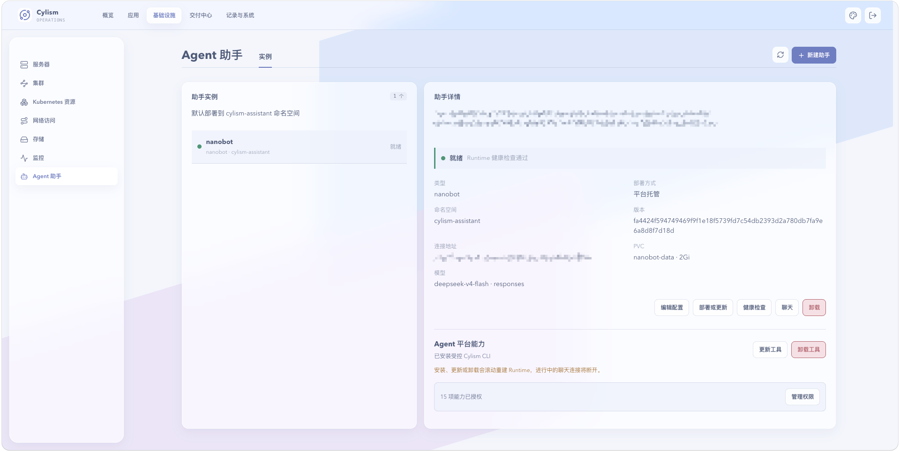

# Agent 助手

## 用途与边界

Agent 助手用于在受管运行时中协助诊断和执行受控操作。它不是拥有无限系统权限的聊天机器人，实际操作受平台授权、审批和可用接口限制。

## 进入位置

进入“Agent 助手”或在告警自动分析相关入口中选择已配置的运行时。

## 准备条件

先配置可用运行时，并确认其权限范围、目标集群和允许操作。对生产环境准备审批人和明确的操作窗口。

## 核心操作

1. 选择合适的运行时，提供问题范围和必要上下文。
2. 优先请求诊断报告，核对告警、指标、日志与关联资源。
3. 对建议的变更确认影响和回退方式，再发起需要审批的操作。
4. 在执行后检查自动化事件、资源状态和告警是否恢复。

<figure class="documentation-screenshot">
  
  <figcaption>Agent 助手：实例标签页展示运行时状态、配置、已授权能力和操作入口。</figcaption>
</figure>

## 状态与风险

Agent 输出是辅助判断，不替代人工审核。不要向助手输入凭据、完整配置文件或敏感业务数据；高风险清理和修复操作必须由授权人员审批。

## 关联页面

[告警](../operations/alerts.md)可触发自动分析；[自动化操作与执行记录](automated-operations.md)追踪处置流程。
