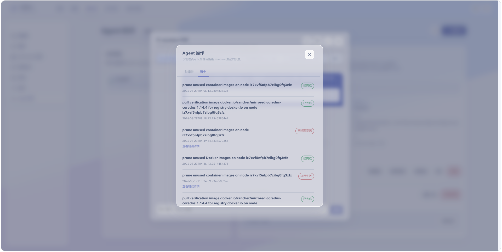

# 自动化操作与执行记录

## 用途与边界

本页说明 Agent 参与的自动分析、审批、执行和复测记录。当前记录围绕受控操作与告警处置，不代表存在一个可编排任意任务的全局自动化中心。

## 进入位置

从告警工作区的自动处置事件进入，或在 Agent 助手中查看相关执行反馈。

## 准备条件

自动分析策略需已启用并绑定可用运行时；规则范围、最低严重程度、冷却时间和执行模式应经过审查。

## 核心操作

1. 查看事件处于告警、分析、等待审批、执行、已恢复或失败的哪个阶段。
2. 阅读 Agent 诊断报告，判断是否需要批准后续动作。
3. 仅对已核实影响范围的操作给予审批，并持续观察复测结果。
4. 失败或未恢复时停止重复执行，转入人工排障并保留事件记录。

<figure class="documentation-screenshot">
  
  <figcaption>Agent 操作：历史标签页展示自动化操作的执行时间、结果和失败原因。</figcaption>
</figure>

## 状态与风险

自动化的“已恢复”应结合真实指标和用户访问再次确认。审批不应成为形式步骤；遇到数据删除、重启或网络变更时，必须明确回退方案和责任人。

## 关联页面

[告警](../operations/alerts.md)配置自动分析策略；[操作历史](../governance/operation-history.md)核对平台任务结果。
