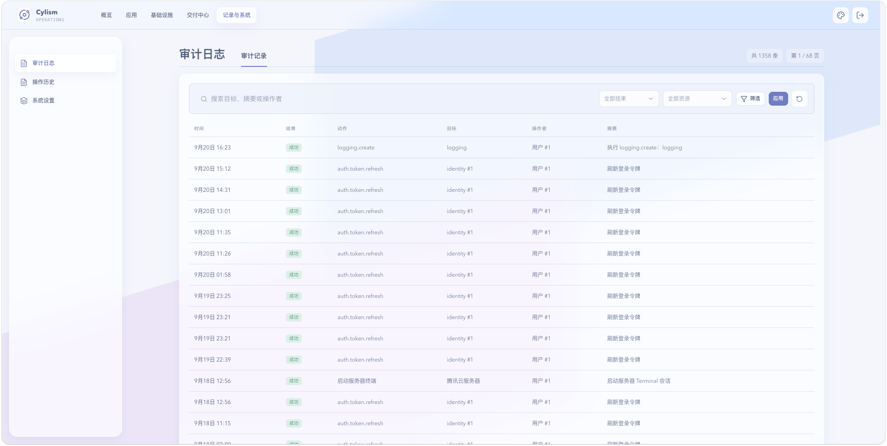

# 审计日志

## 用途与边界

审计日志用于追溯平台中已记录的管理行为，包括操作者、目标、时间和结果。它是调查线索，不替代外部合规系统或完整的主机审计。

## 进入位置

进入“记录与系统”后选择“审计日志”，在“审计记录”标签页按时间、操作者、资源或结果筛选。

## 准备条件

明确要调查的时间范围、资源标识和事件上下文；处理涉及人员信息的记录时遵循组织访问规范。

## 核心操作

1. 使用筛选条件定位某个资源或时间段的管理事件。
2. 打开记录查看操作类型、目标和结果摘要。
3. 将异常操作与操作历史、发布记录或告警时间线对照。
4. 导出或分享前先确认数据脱敏与访问授权。

<figure class="documentation-screenshot">
  
  <figcaption>审计日志：审计记录标签页提供时间、结果、资源等筛选条件，以及操作主体和事件摘要。</figcaption>
</figure>

## 状态与风险

日志记录的是平台可见事件，直接在集群或主机外部执行的操作可能不在其中。不要因单条失败记录重复执行高风险操作，先确认实际资源状态。

## 关联页面

[操作历史](operation-history.md)查看任务执行过程；[身份、权限与安全](identity-permissions-security.md)说明访问边界。
