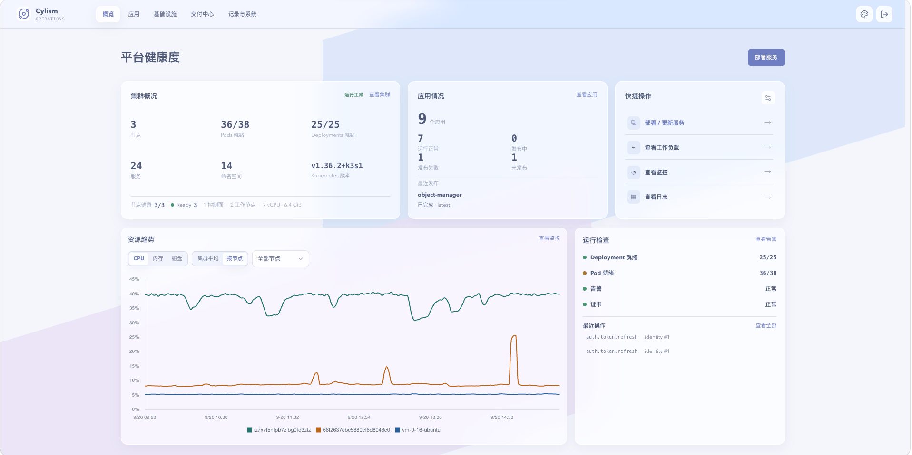

# Cylism Manager

Cylism Manager 将服务器、Kubernetes 集群、应用交付和运维记录放在同一个工作台。本文档按实际管理对象组织：先在概览识别风险，再进入对应产品域处理。

> 平台会通过 Kubernetes API 和受保护的 SSH 凭据执行真实管理操作。部署前请阅读[前置条件](installation/prerequisites.md)和[安全说明](security.md)。

## 概览

概览用于判断下一步该处理什么：平台健康展示集群与核心组件状态；待处理告警突出持续风险；近期发布帮助确认变更影响；关键操作帮助追溯正在执行或刚完成的管理动作。

<figure class="documentation-screenshot">
  
  <figcaption>平台概览：平台健康、待处理告警、近期发布与关键操作。</figcaption>
</figure>

## 产品文档

- [应用交付](application-delivery/projects-and-environments.md)：项目、环境、应用、发布和访问地址。
- [制品与供应链](supply-chain/managed-registry.md)：平台制品库、代理、节点镜像源和 Chart 来源。
- [资源与平台](platform/servers-and-terminal.md)：服务器、集群、Kubernetes、网络、证书和存储。
- [可观测与运维](operations/metrics.md)：指标、日志、告警、磁盘趋势和故障处理。
- [治理与系统](governance/audit-logs.md)：审计、操作历史、系统设置、数据与安全边界。
- [自动化助手](automation/agent-assistant.md)：Agent 管理、授权和自动化执行记录。

## 开始使用

首次部署请从[快速开始](getting-started.md)进入；已有部署流程可选择[脚本安装](installation/install-script.md)或 [Helm 安装](installation/install-helm.md)。
