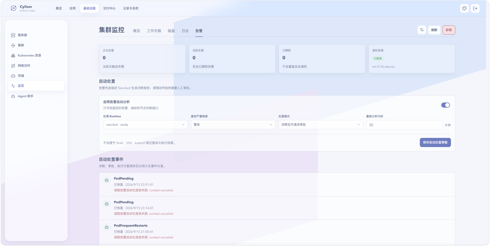

# 集群监控：告警

## 用途与边界

告警工作区管理规则评估、通知、静默及当前告警。可选的自动分析会生成诊断报告；清理或修复动作仍需要人工审批。

## 进入位置

进入“基础设施”后选择“监控”，打开“告警”标签页。

## 准备条件

VictoriaMetrics 与告警组件需可用。启用通知前准备飞书机器人或 SMTP 配置，并选择合适的告警节点。

## 核心操作

1. 安装告警组件，等待规则和 Alertmanager 就绪。
2. 配置通知渠道与合并频率，保存后验证配置状态。
3. 查看正在告警和最近恢复，按严重程度进入关联资源。
4. 对计划维护创建带说明的有限时长静默；需要时启用只读自动分析。

<figure class="documentation-screenshot">
  
  <figcaption>集群监控：告警标签页展示当前告警、通知状态和自动分析配置。</figcaption>
</figure>

## 状态与风险

静默只抑制通知，不解决故障；过宽的匹配条件会掩盖其他问题。自动分析只能使用受限诊断接口，任何实际处置应审核报告、确认影响范围后再批准。

## 关联页面

[指标监控](metrics.md)帮助判断根因；[Agent 助手](../automation/agent-assistant.md)说明受控自动化边界。
