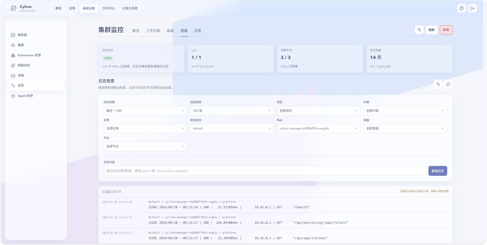

# 集群监控：日志

## 用途与边界

日志工作区用于安装、配置和查询集群日志采集，按命名空间、Pod、容器与时间范围定位运行问题。它不会自动保存所有节点上的任意文件日志。

## 进入位置

进入“基础设施”后选择“监控”，打开“日志”标签页。

## 准备条件

选择就绪数据节点并预留日志存储；安装前确认保留周期和容量策略。查询时先确定命名空间、工作负载和时间窗口。

## 核心操作

1. 安装日志采集并等待 Loki 与采集组件就绪。
2. 使用筛选条件和查询语句定位容器日志。
3. 在设置中调整日志保留天数，保存后观察状态。
4. 需要卸载时确认保留的数据卷和后续恢复计划。

<figure class="documentation-screenshot">
  
  <figcaption>集群监控：日志标签页展示日志采集状态、筛选条件和查询结果。</figcaption>
</figure>

## 状态与风险

日志采集就绪不表示历史日志完整；保留周期外的数据会由后端清理。日志可能包含敏感信息，分享前要脱敏。卸载采集会删除组件和配置，需先确认业务排障需求。

## 关联页面

[指标监控](metrics.md)提供资源信号；[日常维护与故障处理](maintenance-and-troubleshooting.md)给出排障顺序。
