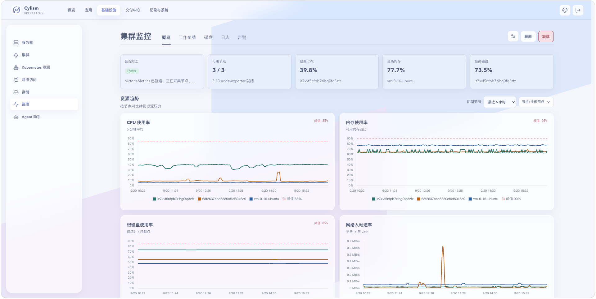

# 集群监控：概览

## 用途与边界

指标监控用于观察集群、节点、工作负载和资源使用趋势，并作为告警与容量判断的依据。它不替代业务 APM 或长期数据仓库。

## 进入位置

进入“基础设施”后选择“监控”，打开“概览”标签页。

## 准备条件

指标组件需已部署并就绪；选择正确时间范围、集群和资源筛选条件。

## 核心操作

1. 查看平台概览中的核心健康指标。
2. 依次缩小到节点、命名空间、工作负载或 Pod，比较 CPU、内存和资源状态。
3. 对异常时间段与发布、日志和告警进行交叉核对。
4. 组件未安装或数据缺失时，先检查集群与系统组件状态。

<figure class="documentation-screenshot">
  
  <figcaption>集群监控：概览标签页展示监控状态、节点可用性及 CPU、内存、磁盘和网络趋势。</figcaption>
</figure>

## 状态与风险

指标通常存在采集延迟，单次尖峰不应直接触发高风险操作。对阈值或采集配置的变更会影响告警判断，应记录变更并观察一个完整评估周期。

## 关联页面

[告警](alerts.md)基于监控规则触发；[磁盘增长](disk-growth.md)分析存储增长趋势。
