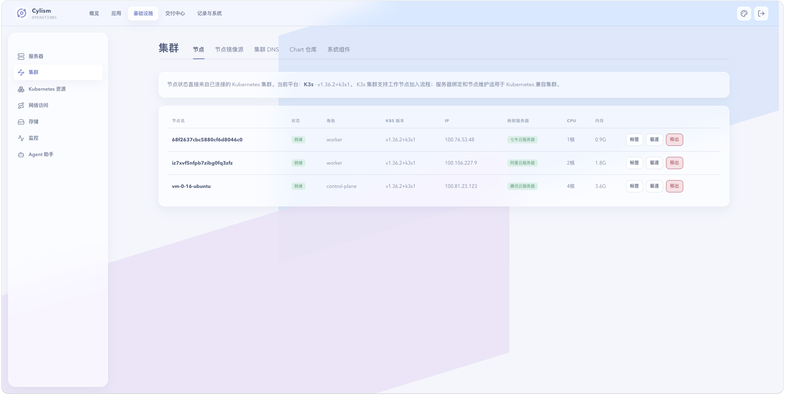

# 集群

## 用途与边界

本页用于查看集群连接、节点状态及平台管理的系统组件。它关注集群基础能力，不用于替代工作负载级故障分析。

## 进入位置

进入“集群”，在概览、节点和系统组件标签页间切换。

## 准备条件

集群凭据和 API 连通性必须正常；对组件进行安装、升级或卸载前，确认兼容版本、节点资源与维护窗口。

## 核心操作

1. 查看控制面、节点和集群连接状态。
2. 进入系统组件，检查安装状态、版本和就绪情况。
3. 根据组件引导完成安装或更新，并观察相关 Pod 变更。
4. 节点异常时先确认网络、磁盘和容器运行时，再继续处理。

<figure class="documentation-screenshot">
  
  <figcaption>集群：节点标签页展示节点状态、角色、版本和映射服务器；同一页面还提供节点镜像源、集群 DNS、Chart 仓库和系统组件标签页。</figcaption>
</figure>

## 状态与风险

组件显示就绪不保证业务请求无误。升级基础组件可能影响全局调度、网络或可观测性，应先阅读发布说明、固定版本并在变更后复测关键服务。

## 关联页面

[Kubernetes 资源](kubernetes-resources.md)查看业务资源；[指标监控](../operations/metrics.md)观察组件影响。
