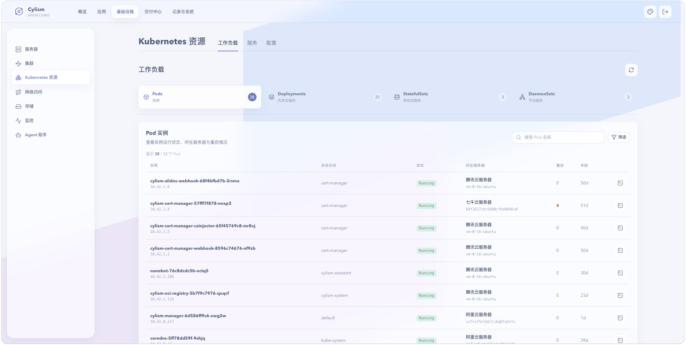

# Kubernetes 资源

## 用途与边界

资源中心聚合工作负载、Service、配置资源和 Pod 终端，便于按命名空间定位问题。它展示并操作当前连接集群的资源，不取代原生 kubectl 的全部能力。

## 进入位置

进入“基础设施”后选择“Kubernetes 资源”，在工作负载、服务和配置标签页间切换；Pod 终端从对应资源进入。

## 准备条件

选择正确的集群与命名空间；修改配置前确认引用它的工作负载和应用发布记录。

## 核心操作

### 工作负载与服务

查看 Deployment、StatefulSet 等工作负载的副本和 Pod 状态，并检查 Service 的端口与后端关联。

### 配置与 Pod 终端

查看 ConfigMap、Secret 等配置引用关系；仅在排障需要时打开 Pod 终端，完成后退出会话。

<figure class="documentation-screenshot">
  
  <figcaption>Kubernetes 资源：工作负载标签页提供 Pod、Deployment、StatefulSet 和 DaemonSet 的汇总与筛选入口。</figcaption>
</figure>

## 状态与风险

资源列表的瞬时状态不代表请求链路健康。直接删除工作负载、Service 或配置会影响应用；Secret 内容属于敏感数据，查看、复制和记录都应遵循最小权限原则。

## 关联页面

[应用工作台](../application-delivery/application-workspace.md)管理受控应用；[日志](../operations/logs.md)和[指标监控](../operations/metrics.md)辅助排障。
