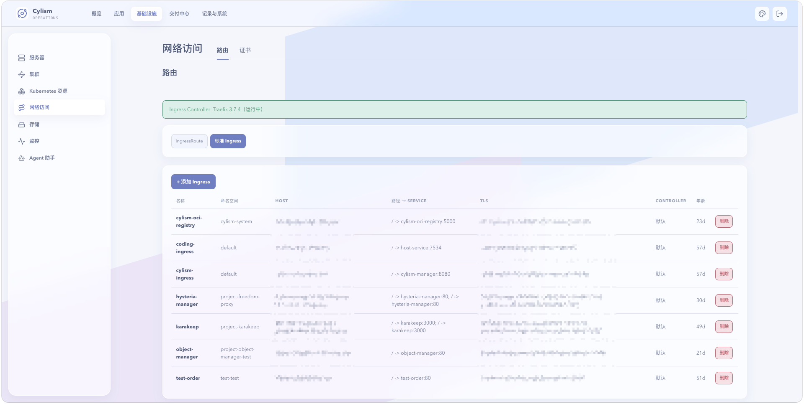

# 网络访问

## 用途与边界

网络访问页面管理路由和证书相关资源；应用域名页则管理应用与入口的绑定。本页不负责外部 DNS 服务商的配置。

## 进入位置

进入“基础设施”后选择“网络访问”，切换路由和证书标签页。

## 准备条件

确认目标域名解析、入口控制器和证书签发条件。修改生产路由前，应明确后端服务、端口及回退规则。

## 核心操作

1. 查看路由或站点的主机名、路径、后端和当前状态。
2. 申请、查看或更新证书，并检查关联 Secret 是否就绪。
3. 配置变更后从外部访问与集群内后端两侧验证。
4. 证书异常时按原因处理 DNS、签发器或 Secret，不要反复创建同名资源。

<figure class="documentation-screenshot">
  
  <figcaption>网络访问：路由标签页展示入口控制器状态、Ingress 类型和路由列表；证书在相邻标签页管理。</figcaption>
</figure>

## 状态与风险

路由生效不表示后端服务健康，证书就绪不表示 DNS 已完成传播。删除或覆盖共享入口会影响多个应用；变更前先确认资源是否被其他命名空间引用。

## 关联页面

[域名与应用访问](../application-delivery/domains-and-access.md)处理应用绑定；[告警](../operations/alerts.md)帮助发现证书和可用性风险。
