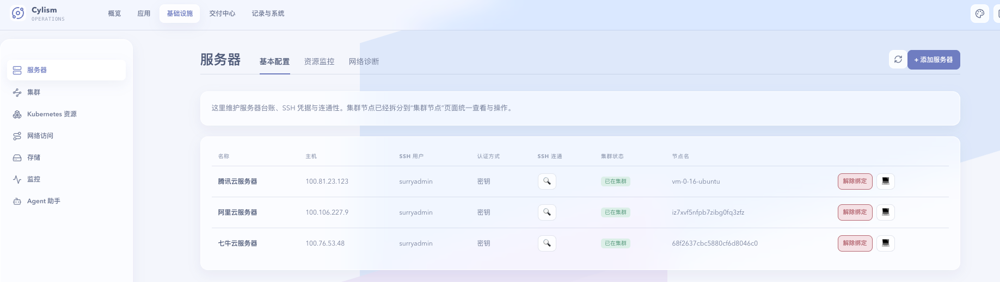

# 服务器

## 用途与边界

服务器页面用于纳管 Linux 服务器、检查连接状态，并在需要时打开受保护终端。终端是服务器页面提供的运维能力，不单独作为一级页面。

## 进入位置

进入“基础设施”后选择“服务器”，选择目标主机查看详情或发起终端会话。

## 准备条件

服务器需满足[前置条件](../installation/prerequisites.md)并具备受保护的 SSH 凭据；操作人员应了解目标主机角色和维护窗口。

## 核心操作

1. 添加服务器，完成连接预检并查看主机状态。
2. 按需打开终端，执行最小范围的诊断或维护命令。
3. 从服务器详情关联集群节点、运行时或磁盘信息。
4. 结束会话后在操作历史中核对关键操作。

<figure class="documentation-screenshot">
  
  <figcaption>服务器：基本配置标签页展示服务器列表、SSH 连通性、集群状态和终端入口；资源监控、网络诊断在相邻标签页中查看。</figcaption>
</figure>

## 状态与风险

连接成功只代表当前 SSH 可达，不能证明系统组件健康。终端命令可能改变生产状态；禁止在会话中暴露凭据，执行破坏性命令前应确认备份和回退方案。

## 关联页面

[集群与系统组件](cluster-and-system-components.md)查看节点与运行时；[操作历史](../governance/operation-history.md)追踪管理动作。
