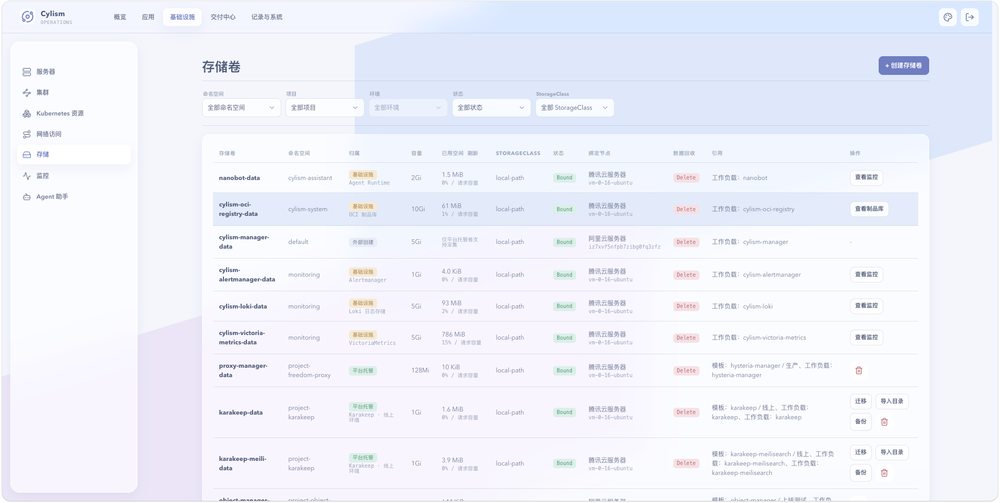

# 存储

## 用途与边界

存储页面覆盖 PVC、数据导入、备份与迁移，帮助维护应用持久化数据。它不保证应用数据逻辑一致性，也不替代数据库自身的备份策略。

## 进入位置

进入“存储”，选择 PVC、数据导入、备份或迁移功能。

## 准备条件

确认 StorageClass、容量、访问模式、目标命名空间和应用停机窗口。执行导入、恢复或迁移前应具备可验证的备份。

## 核心操作

1. 查看 PVC 绑定状态、容量和被挂载的工作负载。
2. 按向导导入数据，确认目标卷和覆盖策略。
3. 创建备份并记录时间点、来源和恢复验证结果。
4. 迁移前停写或冻结业务，完成后校验数据与应用挂载。

<figure class="documentation-screenshot">
  
  <figcaption>存储：存储卷列表展示命名空间、容量、StorageClass、绑定状态、数据回收和引用关系。</figcaption>
</figure>

## 状态与风险

PVC 已绑定不代表卷内数据完整。导入、恢复、迁移和删除都可能覆盖数据；在生产环境执行前必须验证备份可恢复，并避免在业务写入期间切换数据卷。

## 关联页面

[磁盘增长](../operations/disk-growth.md)定位容量变化；[数据库管理](../governance/database-management.md)处理数据库级备份与恢复。
