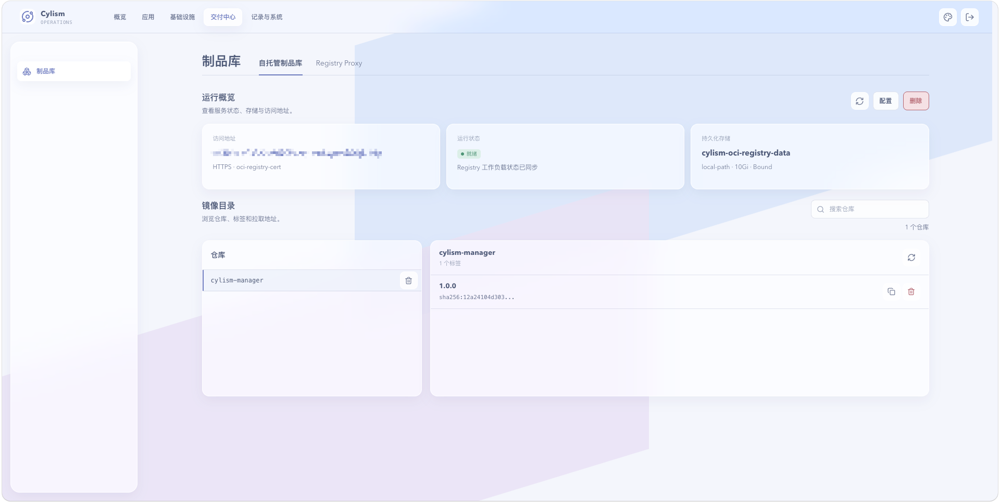

# 自托管制品库

## 用途与边界

自托管制品库用于在平台内创建和维护 OCI 镜像仓库，供项目授权和应用发布使用。它不代替外部镜像仓库，也不自动为所有项目开放访问。

## 进入位置

进入“交付中心”后选择“制品库”，打开“自托管制品库”标签页。

## 准备条件

准备存储、访问入口和仓库命名规则；确认目标项目及环境是否需要授权该仓库。

## 核心操作

1. 创建制品库并确认服务状态、地址和存储配置。
2. 为项目授权仓库，并在项目设置中选择默认仓库。
3. 查看仓库中的镜像与标签，再在应用模板中填写对应镜像路径。
4. 不再使用时先解除项目和发布模板引用，再停用或删除仓库。

<figure class="documentation-screenshot">
  
  <figcaption>制品库：自托管制品库标签页展示运行状态、持久化存储、仓库和镜像标签。</figcaption>
</figure>

## 状态与风险

仓库可用不表示每个节点都能拉取镜像，节点侧策略见[节点镜像源](node-registry-mirrors.md)。删除仓库可能使后续扩容或重新调度失败，先确认没有运行中的镜像依赖。

## 关联页面

[发布与版本记录](../application-delivery/releases.md)使用仓库镜像；[Registry Proxy](registry-proxy.md)处理上游镜像代理。
