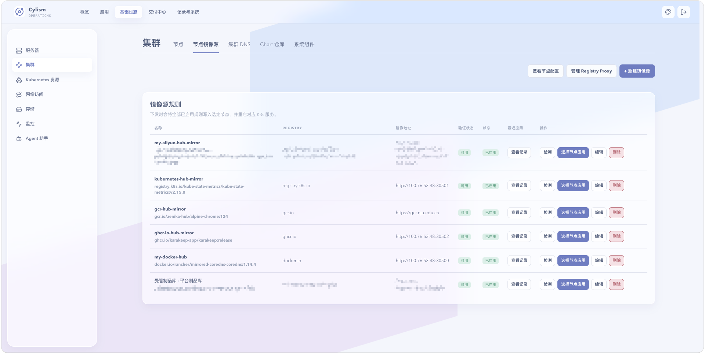

# 节点镜像源

## 用途与边界

节点镜像源用于为集群节点设置镜像拉取的镜像站、代理或 Registry 规则。它影响节点级拉取行为，不会改写已有应用模板中的镜像名称。

## 进入位置

进入“基础设施”后选择“集群”，打开“节点镜像源”标签页。

## 准备条件

确认镜像源地址可从每个目标节点访问，并准备 TLS、认证或私有 CA 所需配置。

## 核心操作

1. 添加或编辑镜像源规则，填写 Registry、端点和认证设置。
2. 验证规则状态，确认配置已应用到目标节点。
3. 用测试工作负载或一次受控发布验证镜像拉取。
4. 变更前导出当前规则，并分批应用到节点。

<figure class="documentation-screenshot">
  
  <figcaption>集群：节点镜像源标签页展示镜像源规则、验证状态、最近应用记录和节点应用入口。</figcaption>
</figure>

## 状态与风险

错误的镜像源会导致新建 Pod 或重调度时拉取失败，现有已运行容器未必立即暴露问题。生产集群应先小范围验证；不要把访问密钥直接写入规则说明。

## 关联页面

[Registry Proxy](registry-proxy.md)提供代理端点；[集群](../platform/cluster-and-system-components.md)用于确认节点状态。
