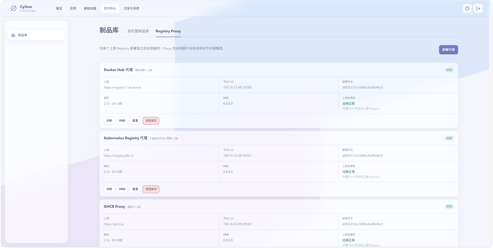

# Registry Proxy

## 用途与边界

Registry Proxy 为上游镜像仓库提供代理入口，减少节点直接访问外部 Registry 的依赖。它不会自动同步所有镜像，也不替代镜像安全审核。

## 进入位置

在受管制品库页面中切换到 Registry Proxy。

## 准备条件

准备上游 Registry 地址及所需的访问凭据，并确认平台代理服务和存储可用。

## 核心操作

1. 新建代理，填写上游地址与认证信息。
2. 启用后用实际镜像拉取验证连通性和缓存行为。
3. 在需要使用代理的项目或节点配置中引用平台代理地址。
4. 更新凭据前先确认上游账户权限和镜像命名空间范围。

<figure class="documentation-screenshot">
  
  <figcaption>制品库：Registry Proxy 标签页展示上游 Registry、缓存、节点入口和上游连通性。</figcaption>
</figure>

## 状态与风险

代理健康仅反映服务和上游连接；具体镜像仍可能因权限、标签不存在或网络限制而失败。凭据属于敏感配置，不在文档、日志或截图中记录明文。

## 关联页面

[节点镜像源](node-registry-mirrors.md)配置节点拉取策略；[自托管制品库](managed-registry.md)适合自有镜像托管。
